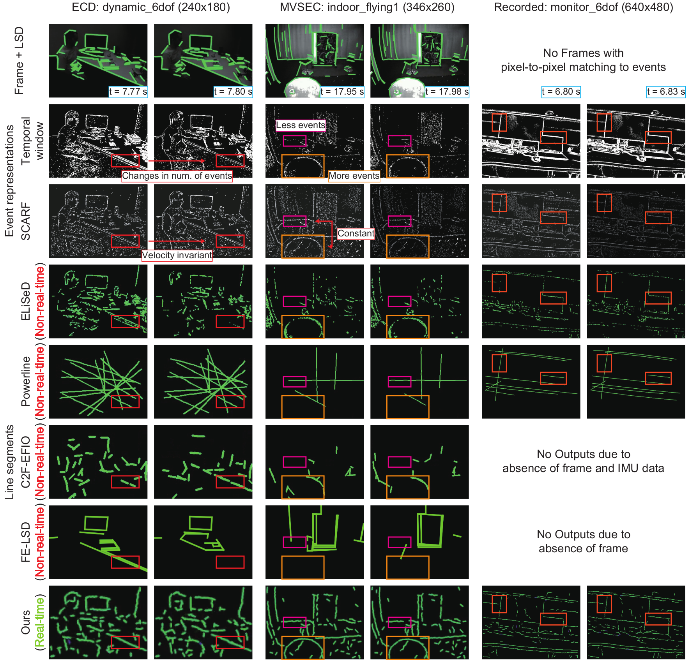

# RT-EvLDT
<h2 align="center">Lattice-allocated Real-time Line Segment Feature Detection and Tracking Using Only an Event-based Camera</h2>
<p align="center">
    <a href="https://mikihiroikura.github.io/">Mikihiro Ikura</a><sup>1</sup> &emsp;&emsp;
    Arren Glover<sup>1</sup> &emsp;&emsp;
    Masayoshi Mizuno<sup>2</sup> &emsp;&emsp;
    Chiara Bartolozzi<sup>1</sup>
</p>

<p align="center">
    <sup>1</sup>Istituto Italiano di Tecnologia &emsp;&emsp;
    <sup>2</sup>Sony Interactive Entertainment Inc. &emsp;&emsp;
</p>

<p align="center">
  <a href="https://arxiv.org/abs/2510.06829">
    
  </a>
  &nbsp;&nbsp;
  <a href="https://doi.org/10.5281/zenodo.17299174">
    
  </a>
</p>

This repository is the official implementation of the paper "Lattice-allocated Real-time Line Segment Feature Detection and Tracking Using Only an Event-based Camera", which was presented on
2nd Workshop on Neuromorphic Vision: Advantages and Applications of Event Cameras (NeVi2025), International Conference on Computer Vision (ICCV) as a **Spotlight session**.

## 🎥 Video

https://github.com/user-attachments/assets/f1c6d5f4-05b0-41b7-9107-a626853c74cb


## 📋 Qualitative evaluation of line segments


## 📐 Setup environment
### Build docker image
```
docker build --build-arg UID=$(id -u) --build-arg GID=$(id -g) -t ledge:latest .
```
- Input current User ID and Group ID into Docker environment

### Run and enter docker container with docker compose
```
docker compose up -d
docker exec -it ledge /bin/bash
```
- if you fail to run docker container with the issue about nvidia runtime in docker, please take a look at this [link](https://docs.nvidia.com/datacenter/cloud-native/container-toolkit/latest/install-guide.html).
- You can change the mounted directory described in `docker-compose.yaml` to run LEDGE with your recorded data.

### Open X Server for docker environment
```
xhost local:docker
```
### Change permission in USB event camera to work the camera in Docker container with non-root user by adding udev rules in your host environment
```
## Run .sh in your `host` environment 
sudo chmod +x setup_usb_permissions.sh
./setup_usb_permissions.sh
```

## 📚 Library contents
### [ledge](./ledge/)
C++ LEDGE library including the following functions
- `core`: core functions for LEDGE, such as initialization, visualization, etc.
- `detection`: functions for detecting line segments
- `tracking`: functions for tracking line segments
- `manager`: functions for managing line segments

### [example](./example/)
C++ implemented examples to show how to use LEDGE library into the project.

### [unit_test](./unit_test/)
C++ Google test codes to confirm that implemented functions work correctly with pre-defined groud truth data.
- All tests are executed automatically in Github Actions.
- All tests should be passed to merge pull request.

## 🐍 [Python scripts](./scripts/)
### Create virtual environment
```
cd /app/LEDGE
uv sync
```
### Update submodules
```
git submodule update --init --recursive
```
### Run Python scripts with uv
```
cd /app/LEDGE
uv run scripts/***.py
```
- `uv run scripts/***.py -h`: Show help to introduce how to run each script.

## 🔨 clang-format
You can format all `*.h` and `*.cpp` files in this repository by using the following commands

Terminal
```
sudo apt install clang-format # you can skip this command if you are in docker container

find ledge unit_test example -path '*/build/*' -prune -o \( -name '*.cpp' -o -name '*.h' \) -print  | xargs clang-format -i -style=file --verbose
```
